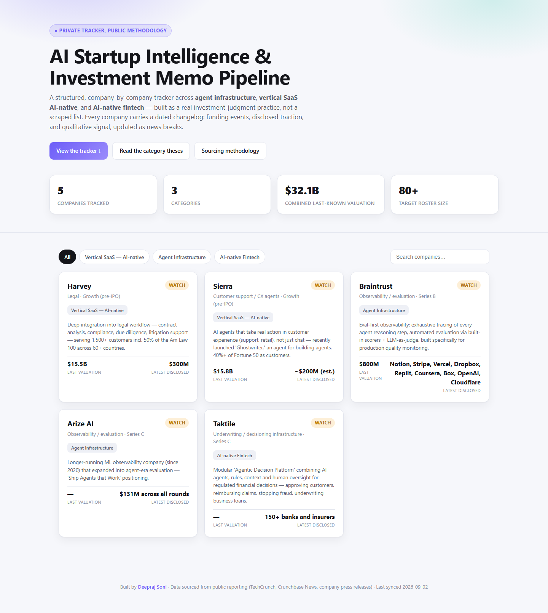
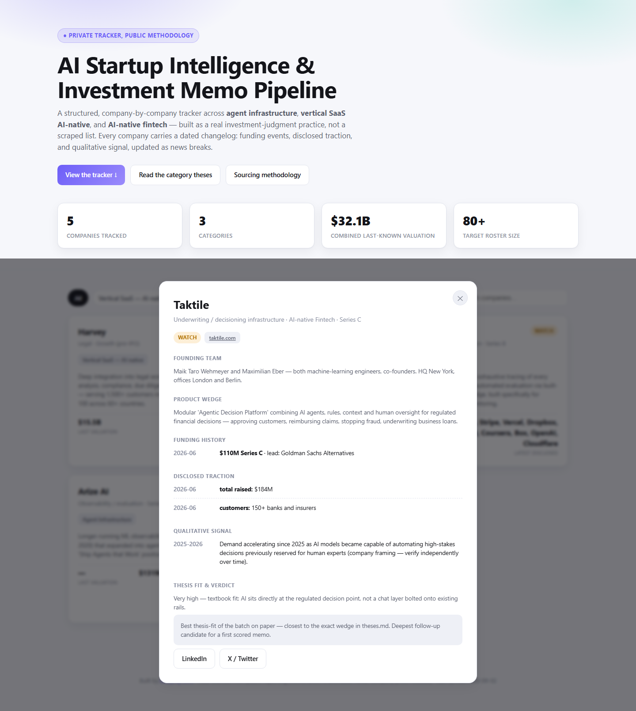

# AI Startup Intelligence & Investment Memo Pipeline

**A self-built, end-to-end investment research practice — thesis writing, structured company tracking, and a live dashboard — covering agent infrastructure, vertical SaaS AI-native, and AI-native fintech.**

This isn't a scraped spreadsheet. It's a repeatable pipeline: written investment theses that define what "good" looks like *before* any company is scored, a reusable sourcing system to find candidates on a weekly cadence, structured per-company profiles with dated changelogs (not one-time snapshots), and a dashboard to browse and compare them — all built solo, from data model to UI to deployment.

**[→ Live dashboard](https://deeprsoni.github.io/ai-startup-tracker/)** &nbsp;·&nbsp; **[Category theses](theses.md)** &nbsp;·&nbsp; **[Sourcing methodology](sourcing-list.md)**

---

## Why this exists

I wanted to build genuine investment judgment across three categories I think are underrated or under-covered relative to how fast they're moving — not by reading hot takes, but by doing the actual work: writing a thesis, defending it against real companies, and being honest when a company doesn't fit. The end goal is a track record real enough to eventually support a scout or angel program conversation — but the practice has to be real first, so it's private until it's proven.

This repo is the public face of that practice: the methodology and the tooling, not the ongoing private research itself.

## What's actually in here

| Piece | What it does | File |
|---|---|---|
| **Category theses** | Three written theses (agent infra, vertical SaaS AI-native, AI-native fintech) — the real trend, what's overhyped, the winning wedge, an 18-month view, and explicit scoring cues. This is the yardstick every company gets measured against. | [`theses.md`](theses.md) |
| **Sourcing system** | 18 concrete, reusable sources across general + category-specific lists, plus a weekly cadence (Mon/Wed/Fri) — designed so sourcing 80+ companies is a repeatable habit, not a fresh search every time. | [`sourcing-list.md`](sourcing-list.md) |
| **Company tracker (dashboard)** | A live, filterable, searchable dashboard over every tracked company — funding history, disclosed traction, qualitative signal, and a scored verdict, each on a dated changelog. Zero build step: plain HTML/CSS/JS, deployed straight to GitHub Pages. | [`index.html`](index.html) |
| **Structured data** | The tracker's data model — one record per company, versioned as code. | [`data/companies.js`](data/companies.js) |

## The dashboard

  

  

Each company profile tracks three separate, dated timelines rather than a single static blob:

- **Funding history** — round, amount, valuation, lead investor, dated.
- **Disclosed traction** — ARR/revenue milestones, customer counts, only when actually disclosed publicly.
- **Qualitative signal** — hiring, launches, partnerships, notable social/press moments between funding events.

That distinction matters: for private companies, "performance" isn't a continuous feed like a public stock ticker — it's whatever gets disclosed, when it gets disclosed. The schema is built around that reality instead of pretending otherwise.

## How a company gets in

1. **Sourced** from the weekly cadence in [`sourcing-list.md`](sourcing-list.md) — YC batches, fund portfolio pages, category press, funding trackers.
2. **Logged** as a structured profile: category, subcategory, stage, founding team, product wedge, socials.
3. **Scored** against the relevant category thesis in [`theses.md`](theses.md) for thesis-fit.
4. **Verdicted** — watch / pass / revisit, with an explicit written rationale (no verdict ships without one).
5. **Updated over time** — every new funding round, disclosed metric, or notable signal is appended to that company's changelog. Nothing gets overwritten; the point is to see the trajectory, not just the current state.

## Tech

- **Zero-dependency frontend** — vanilla HTML/CSS/JS, no framework, no build step, no bundler. Opens directly in a browser or deploys straight to GitHub Pages.
- **Data as code** — company records live in a plain JS module (`data/companies.js`), so the entire dataset is diffable, versioned, and reviewable in a pull request like any other change.
- **Dark-mode aware** — respects system theme automatically.

## What's next

- Scale toward 80+ tracked companies at a ~4-5/week sourcing cadence.
- A scored investment memo template applied to the highest-conviction picks (in progress — see the pipeline's task list).
- Public-facing written notes (LinkedIn/Substack) once the practice has a real track record behind it — deliberately not yet.

---

Built solo by <a href="https://github.com/DeeprSoni"><strong>Deepraj Soni</strong></a>

